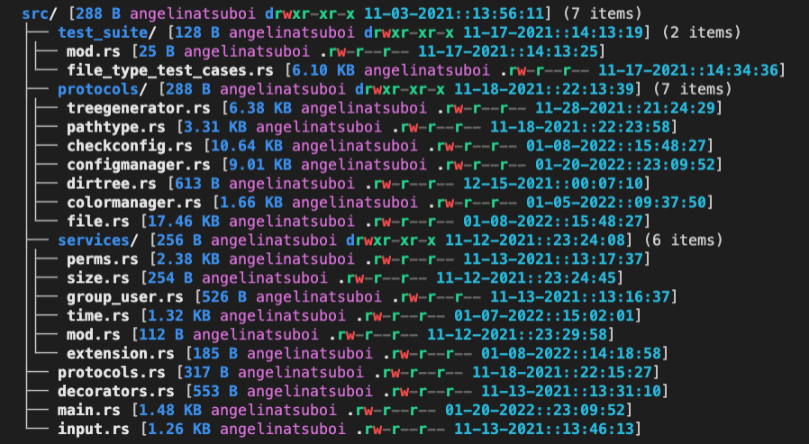
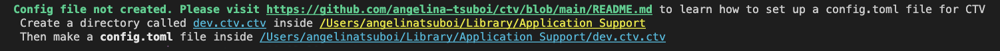

# ctv - configurable tree view

A highly configurable tree view visualizer CLI tool written in Rust!




## What does ctv do?

- Visualize your file hiearchy in a tree view
- Customize the apperance of your tree
- Display custom file information (permissions, time, user, etc)
- Personalize tree color and text styling

## Installation
``` bash
# Cargo Installation
cargo install ctv

# Homebrew Installation
brew install angelina-tsuboi/ctv/ctv
```

## Using ctv
``` bash
ctv <flags> <directory_path>
```
## Flag Options
    -i, --ct         Shows the file created time instead of the file modified time
        --help       Prints help information
    -h, --short      Uses short format
    -c, --config       Show all config variables
    -s, --set-var       Set config variable via CLI
    -V, --version    Prints version information
    -l, --layer <layer>        Sets tree layer limit

## Customization
The config.toml file located within the ctv project directory (dev.ctv.ctv) allows you to customize the apperance of your tree display!
The dev.ctv.ctv directory and config.toml file must be manually created to start configuring your tree view! 

### Set Up Customization
                                                                     
#### Step 1: Run CTV
```bash
ctv
```

#### Step 2: Copy the Yellow, Underlined Path Printed from the top of the CTV command 



#### Step 3: Go inside the copied path
```bash
cd <copied-path>
```

#### Step 4: Make a dev.ctv.ctv directory
```bash
mkdir dev.ctv.ctv
cd dev.ctv.ctv
```

#### Step 5: Make a config.toml file
```bash
touch config.toml
```

#### Step 6: Copy the Default Configurable config.toml variables BELOW and paste into config.toml


#### Default Configurable config.toml variables
```
file_size_position="1"
file_owner_position="2"
file_perms_position="3"
file_time_position="4"
file_extension_position="-1"
dir_name_color="BLUE"
file_name_color="LIGHTRED"
file_time_color="LIGHTCYAN"
file_size_color="BLUE"
file_owner_color="LIGHTMAGENTA"
file_perms_color="BLUE"
file_extension_color="YELLOW"
dir_name_style="NORMAL"
file_name_style="NORMAL"
file_time_style="BOLD"
file_size_style="BOLD"
file_owner_style="NORMAL"
file_perms_style="BOLD"
file_extension_style="ITALIC"
file_time_format="%m-%d-%Y::%H:%M:%S"
file_time_type="CREATED"
tree_layer_limit="3"
show_file_metadata="TRUE"
show_dir_metadata="TRUE"
pipe="│"
elbow="└──"
tee="├──"
pipe_prefix="│"
space_prefix=" "
dir_color="BLUE"
symlink_color="LIGHTMAGENTA"
path_color="WHITE"
pipe_color="YELLOW"
chard_color="YELLOW"
blockd_color="LIGHTGREEN"
socket_color="LIGHTRED"
read_color="LIGHTGREEN"
write_color="LIGHTRED"
execute_color="LIGHTGREEN"
dash_color="LIGHTBLACK"
spacing="0"
show_short="false"
```

### Font Color and Styling Options

#### Available Colors
```bash
BLACK
BLUE
CYAN
GREEN
LIGHTBLACK
LIGHTBLUE
LIGHTCYAN
LIGHTGREEN
LIGHTMAGENTA
LIGHTRED
LIGHTWHITE
LIGHTYELLOW
MAGENTA
RED
WHITE
YELLOW
```

#### Available Font Styles
```bash
BOLD
DIMMED
ITALIC
UNDERLINE
BLINK
REVERSE
HIDDEN
STRICKEN
NORMAL
```