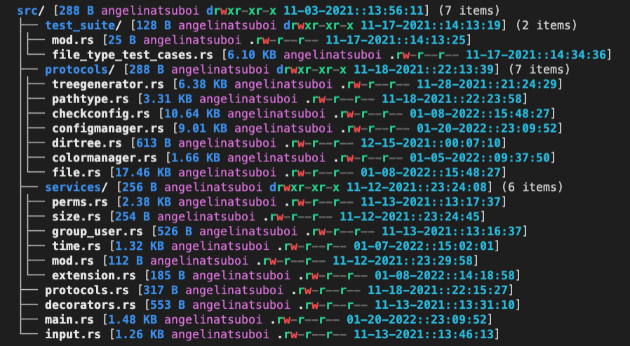

# 🎄 ctv - configurable tree view 🎄

A highly configurable tree view visualizer CLI tool written in Rust!



## What does ctv do?

- Visualize your file hierarchy in a tree view
- Customize the appearance of your tree
- Display custom file information (permissions, time, user, etc)
- Personalize tree color and text styling

## Installation

```bash
# Cargo Installation
cargo install ctv

# Homebrew Installation
brew install angelina-tsuboi/ctv/ctv
```

## Using ctv

```bash
ctv <flags> <directory_path>
```

## Flag Options

    -h, --short
        --help             Print help information
    -l, --limit <LIMIT>
    -p, --config           Show config variables and exit
    -V, --version          Print version information

# Customization

## Config File

The `config.toml` file located at `~/.config/ctv.toml` allows you to customize the appearance of your tree display!
If the configuration does not exist, defaults will be used.

## Via Environment

Additionally, you can specify configuration via environment variables. For example, here's two ways of specifying the sort order:

```toml
# config.toml
sorting = ["size", "name", "time"]
```

```bash
CTV_SORTING='["size", "name", "time"]' ctv
```
