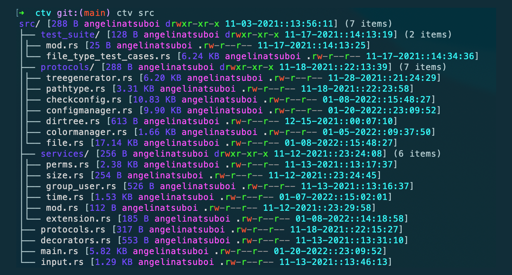

# ctv - configurable tree view

A highly configurable tree view visualizer CLI tool written in Rust!




## What does ctv do?

- Visualize your file hiearchy in a tree view
- Customize the apperance of your tree
- Display custom file information (permissions, time, user, etc)
- Personalize tree color and text styling

## Installation
``` bash
cargo install ctv
```

## Using ctv
``` bash
ctv <flags> <directory_path>
```
## Flag Options
    -i, --ct         Shows the file created time instead of the file modified time
        --help       Prints help information
    -h, --short      Uses short format
    -e, --env        Show all ENV variables
    -V, --version    Prints version information
    -l, --layer <layer>        Sets tree layer limit
    --set-env <set-env>    Set custom ENV Variable via CLI

## Setting ENV variable via CLI
```bash
 --set-env <set-env> 
```
### Set ENV Command Format
```bash
--set-env "<env-name>=<env-value>"
```

### Example
```
ctv --set-env "DIR_COLOR=WHITE"
```

## Customization
The .env contained within ctv allows you to customize the apperance of your tree display!

#### Configurable ENV variables
```
FILE_SIZE_POSITION="1"
FILE_OWNER_POSITION="2"
FILE_PERMS_POSITION="3"
FILE_TIME_POSITION="4"
FILE_EXTENSION_POSITION="-1"
DIR_NAME_COLOR="LIGHTRED"
FILE_NAME_COLOR="LIGHTRED"
FILE_TIME_COLOR="LIGHTCYAN"
FILE_SIZE_COLOR="BLUE"
FILE_OWNER_COLOR="MAGENTA"
FILE_PERMS_COLOR="BLUE"
FILE_EXTENSION_COLOR="YELLOW"
DIR_COLOR="BLUE"
SYMLINK_COLOR="LIGHTMAGENTA"
PATH_COLOR="WHITE"
PIPE_COLOR="YELLOW"
CHARD_COLOR="YELLOW"
BLOCKD_COLOR="LIGHTGREEN"
SOCKET_COLOR="LIGHTRED"
READ_COLOR="LIGHTGREEN"
WRITE_COLOR="LIGHTRED"
EXECUTE_COLOR="LIGHTGREEN"
DASH_COLOR="LIGHTBLACK"
DIR_NAME_STYLE="NORMAL"
FILE_NAME_STYLE="NORMAL"
FILE_TIME_STYLE="BOLD"
FILE_SIZE_STYLE="BOLD"
FILE_OWNER_STYLE="NORMAL"
FILE_PERMS_STYLE="BOLD"
FILE_EXTENSION_STYLE="ITALIC"
FILE_TIME_FORMAT="%m-%d-%Y::%H:%M:%S"
FILE_TIME_TYPE="CREATED"
SHOW_SHORT="FALSE"
TREE_LAYER_LIMIT="3"
SPACING="0"
PIPE=│
ELBOW=└──
TEE=├──
PIPE_PREFIX=│ 
SPACE_PREFIX= 
SHOW_FILE_METADATA="TRUE"
SHOW_DIR_METADATA="TRUE"
```